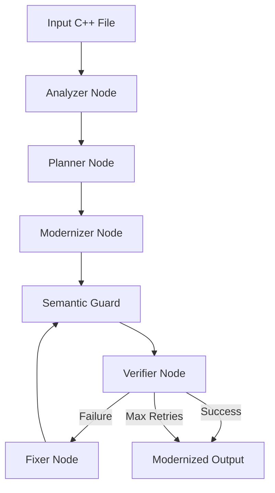

# Air-Gapped Codebase Modernization Engine

Modernizes legacy C/C++ code into idiomatic C++17 using a modular, high-stability LangGraph workflow powered by a Multi-Model LLM bridge with deterministic rule fallbacks.

## Project Overview

The engine utilizes a state-graph architecture to transform legacy C++ into modern C++17. The pipeline follows a structured "Phase 4" flow:

**Analyzer → Planner → Rule Engine → LLM → Guard → Compiler → Fixer**

### Multi-Model LLM Strategy
The engine is optimized for the NVIDIA API gateway, routing specialized agents to advanced models:
- **Analyzer/Planner:** `meta/llama-3.3-70b-instruct` or `deepseek-ai/deepseek-v3`
- **Modernizer/Fixer:** `meta/llama-3.3-70b-instruct`

High-stability logic is built-in: the engine performs **15 retry attempts** with a mandatory **60-second delay** between calls to ensure resilience against API rate limits (429 errors).

## Architecture



## Core C++17 Features

The engine specializes in "Perfect" C++17 modernization:
- **RAII Enforcement**: Replaces `malloc`/`free` and manual memory with `std::vector`, `std::unique_ptr`, and smart resource management.
- **Logical Const-ness**: Identifies member variables needing `mutable` to allow logging/caching from `const` methods.
- **Efficiency**: Upgrades read-only string handles to `std::string_view`.
- **Thread Safety**: Replaces non-thread-safe C time functions with `localtime_s` (Windows) or `localtime_r` (POSIX).

## Installation

1. Create a virtual environment:
   ```powershell
   python -m venv .venv
   .\.venv\Scripts\activate
   ```
2. Install dependencies:
   ```powershell
   pip install .
   ```

## Usage

Run the modernization engine via the professional CLI:

```powershell
modernization-engine <path_to_file.cpp> --verbose
```

Or using the python script:

```powershell
python cli.py <path_to_file.cpp> -v
```

### CLI Options

| Flag | Long Flag | Description |
| --- | --- | --- |
| `-o` | `--output` | Custom output path for modernized code. |
| `-v` | `--verbose` | Enable detailed debug logging. |
| | `--version` | Show program version. |

## Configuration

Configure your `.env` file with your NVIDIA API key and preferred models. See `.env.example` for all available options.

## Quality Assurance

The project includes:
- **Unit Tests**: Run via `pytest`.
- **Linting/Formatting**: Managed by `black` and `ruff`.
- **Pre-commit Hooks**: Configured in `.pre-commit-config.yaml`.

## License

MIT
